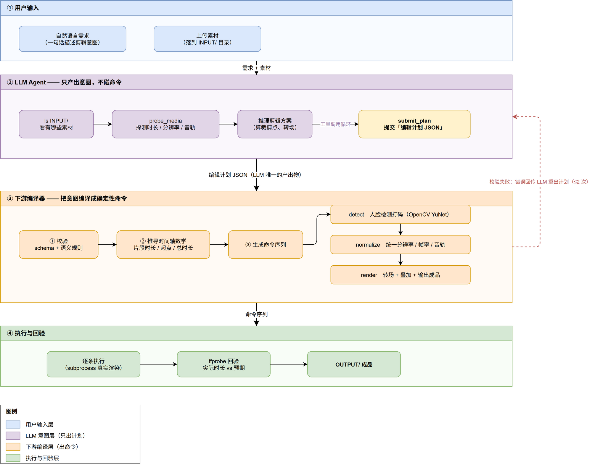

# SmartTrimAgent 实现总览

> **一句话**：用户用自然语言描述剪辑需求 → LLM 产出「编辑计划 JSON」→
> 下游编译器把计划编译成确定性命令（ffmpeg / OpenCV）执行并回验。
>
> 配图：[architecture-flow.drawio](./architecture-flow.drawio)（可编辑）·
> [architecture-flow.png](./architecture-flow.png)



## 四层职责

| 层 | 谁 | 输入 → 输出 | 关键点 |
|---|---|---|---|
| ① 用户输入 | 用户 | 一句话 + 素材 → 任务 | 素材落 `INPUT/`（Web 上传或手动放） |
| ② **LLM Agent** | 模型 | 任务 → **编辑计划 JSON** | 只出意图，绝不写命令 |
| ③ **下游编译器** | 程序 | 计划 JSON → 命令序列 | 校验 / 换算 / 生成，全确定性 |
| ④ 执行与回验 | 程序 | 命令序列 → `OUTPUT/` 成品 | subprocess 执行 + ffprobe 回验 |

## ② LLM 做了什么

整个 Agent 环节只做三件事：

1. **`ls INPUT/`** —— 看有哪些素材
2. **`probe_media`** —— 探测真实时长 / 分辨率 / 有无音轨（拿到数据才能算裁剪点）
3. **`submit_plan`** —— 提交编辑计划 JSON

**唯一产出物就是那份 JSON**，它不含任何 ffmpeg 语法，也不含任何时间轴数学：

```json
{
  "output": { "filename": "OUTPUT/final.mp4", "resolution": {"width":1280,"height":720}, "fps": 30 },
  "clips": [
    { "id": "c1", "source": "INPUT/a.mp4", "kind": "video",
      "trim_start": 0, "trim_end": 8,
      "effects": [ {"name": "face_mosaic", "args": {"mode": "mosaic"}} ] }
  ],
  "timeline": [ { "clip": "c1" } ],
  "overlays": []
}
```

## ③ 下游做了什么

编译器拿到计划后三步走，全部是确定性程序：

1. **校验** —— schema + 白名单 + 语义规则（时间不越界、引用存在、参数合法）
2. **推导时间轴数学** —— 片段时长 `d_i`、各片段起点 `S_i`、转场重叠后的总时长 `D`、overlay 绝对时间
3. **生成命令序列** —— 按三个阶段展开：

| 阶段 | 干什么 | 执行者 |
|---|---|---|
| `detect` | 人脸检测打码（仅当计划里声明了 `face_mosaic`） | **OpenCV YuNet** |
| `normalize` | 把异构素材统一成同分辨率 / 帧率 / 音轨 | ffmpeg |
| `render` | 转场 + 画中画 + 花字 + 输出 | ffmpeg |

`detect` 阶段的存在方式值得注意：编译器识别到 `face_mosaic` 后，**额外插入一条 Python 子命令**，
并把后续归一化命令的输入从 `INPUT/a.mp4` 悄悄替换成打码后的 `TMP/c1_masked.mp4`。

生成后由 ④ 层逐条 `subprocess` 执行，最后用 ffprobe 回验产物时长。

## 为什么这样分

| | LLM 负责 | 下游负责 |
|---|---|---|
| 擅长 | 理解意图、处理歧义 | 精确数学、语法正确性 |
| 产出形态 | **声明式**（要什么效果） | **命令式**（怎么算、该调什么） |
| 出错时 | prompt 约束 + 校验器兜底 | 确定性代码，可回归测试 |

关键点：**LLM 完全不需要知道底层跑的是 ffmpeg 还是 YuNet 模型**（它连"人脸坐标"都没见过）。
所以新增能力（人声分离、画面超分等）只需在编译器里加一条 `effect → 命令` 的映射，
LLM 侧只要认识那个名字就够了。

## 失败与重试

- **Web 入口**：计划校验失败 → 把编译器的中文错误回传 LLM 重出计划（最多 2 次）
- **CLI**：校验失败直接退出并打印错误列表

## 模块清单

| 文件 | 职责 |
|---|---|
| `video_editing/video_agent.py` | Agent 构建、计划 schema 提示词、`extract_plan()` |
| `video_editing/plan_schema.py` | 计划校验：白名单 + 语义规则 |
| `video_editing/plan_compiler.py` | 编译器五步：校验 → 推导 → 生成 → 执行 → 回验 |
| `video_editing/face_mosaic.py` | 人脸检测打码（YuNet + 跟踪平滑 + 音频保留） |
| `video_editing/ffmpeg_exec.py` | ffmpeg / ffprobe 执行器（未安装时返回可读错误） |
| `web/server.py` · `web/index.html` | Web 入口：素材上传 + NDJSON 事件流 |
| `model.py` | 模型解析（`.env` 优先级链） |

## 相关文档

- [v3.0-face-mosaic.md](./v3.0-face-mosaic.md) —— 人脸打码能力方案（模型选型 / 跟踪策略）
- [v2.0-multi-material-editing.md](./v2.0-multi-material-editing.md) —— 计划 schema 与时间轴数学详解
- [v2.0-overview.md](./v2.0-overview.md) —— v2 时期的整体方案
- [v1.0-architecture.md](./v1.0-architecture.md) —— v1 单命令版（对照）
