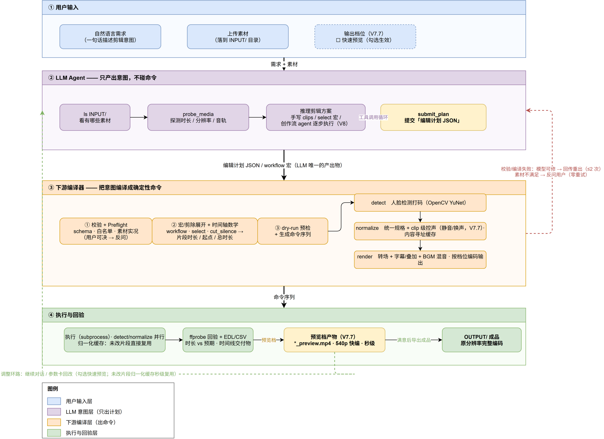

# SmartTrimAgent 实现总览

> **一句话**：用户用自然语言描述剪辑需求 → LLM 产出「编辑计划 JSON」（或挑一个
> **workflow 宏**只填参数）→ 下游编译器把计划编译成确定性命令
> （ffmpeg / OpenCV）执行并回验。
>
> 配图：[architecture-flow.drawio](./architecture-flow.drawio)（可编辑）·
> [architecture-flow.png](./architecture-flow.png)
> 细节图（计划如何生成：Agent 工具循环 / 校验闭环 / Skills 注册表）：
> [architecture-plan-generation.drawio](./architecture-plan-generation.drawio) ·
> [architecture-plan-generation.png](./architecture-plan-generation.png)
> 模块分层图（入口 / Agent / 感知 / 编译器 / 执行 + smart_create 流程页）：
> [architecture.drawio](./architecture.drawio) ·
> [architecture-p1-layers.drawio.png](./architecture-p1-layers.drawio.png) ·
> [architecture-p2-smart-create.drawio.png](./architecture-p2-smart-create.drawio.png)



## 四层职责

| 层 | 谁 | 输入 → 输出 | 关键点 |
|---|---|---|---|
| ① 用户输入 | 用户 | 一句话 + 素材 → 任务 | 素材落 `INPUT/`（Web 上传或手动放） |
| ② **LLM Agent** | 模型 | 任务 → **编辑计划 JSON** | 只出意图，绝不写命令 |
| ③ **下游编译器** | 程序 | 计划 JSON → 命令序列 | 校验 / 换算 / 生成，全确定性 |
| ④ 执行与回验 | 程序 | 命令序列 → `OUTPUT/` 成品 | subprocess 执行 + ffprobe 回验 |

## ② LLM 做了什么

Agent 环节的工具清单（deepagents 工具循环，模型自己决定节奏）：

1. **`ls INPUT/`** —— 看有哪些素材（文件系统工具，backend 内置）
2. **`probe_media`** —— 探测真实时长 / 分辨率 / 有无音轨（拿到数据才能算裁剪点）
3. **`analyze_media`**（V4，语义任务才调用）—— 建立镜头级内容卡：TransNetV2 /
   场景切分出边界，VLM 打标签（人数/场景/活动/画质/desc 画面描述），静音/黑场
   信号并入；结果 sidecar 缓存，上传即索引，第二次零成本
4. **`submit_plan`** —— 提交编辑计划 JSON（唯一产出物）
5. **`ask_user`**（V3.1）—— 意图含糊 / 要求超出素材实际 / 超出能力时**先反问**，
   与 submit_plan 互斥，不算失败

**唯一产出物就是那份 JSON**，它不含任何 ffmpeg 语法，也不含任何时间轴数学。
除了手写 clips，还有两条「少写甚至不写」的路：

```json
{
  "output": { "filename": "OUTPUT/final.mp4", "resolution": {"width":1280,"height":720}, "fps": 30 },
  "clips": [
    { "id": "c1", "source": "INPUT/a.mp4", "kind": "video",
      "trim_start": 0, "trim_end": 8,
      "effects": [ {"name": "face_mosaic", "args": {"mode": "mosaic"}} ] }
  ],
  "timeline": [ { "clip": "c1" } ],
  "overlays": []
}
```

- **workflow 宏（V7）**：`{"workflow": {"name": "smart_create", "budget_seconds": 25}}`
  ——LLM 只挑工作流 + 填少量参数（预算/关键词/配乐/字幕样式），「粗筛 → 选材 →
  编排 → 文案 → 配乐」全部由编译器确定性展开（见
  [v7.0-oneclick-and-perf.md](./v7.0-oneclick-and-perf.md)）；
- **select 宏（V5）**：`{"select": {"sources": [...], "where": {...}, "budget_seconds": 30}}`
  ——按内容卡标签筛选镜头，编译器从卡片确定性生成 clips，模型不手抄时间区间。

## ③ 下游做了什么

编译器拿到计划后走一条确定性流水线（LLM 不参与）：

1. **校验** —— schema + 白名单 + 语义规则（时间不越界、引用存在、参数合法）；
   Preflight 以**服务端真实探针**交叉比对计划与素材实况，模型修得了的错误回传
   重出、只有用户能决的直接转反问（V3.1 错误分流）
2. **宏与剪除展开** —— workflow 宏（粗筛 culling → select 选材 → 装填 → 文案
   提供器链 plan→llm→labels → 字幕样式 bottom/credits → 自动配乐 `_attach_bgm`）；
   `select` 从内容卡确定性生成 clips；`cut_silence` / `cut_black` 实时跑
   silencedetect/blackdetect，静音/黑场区间**取补集**展开成保留子段
3. **推导时间轴数学** —— 片段时长 `d_i`（含变速缩放）、各片段起点 `S_i`、
   转场重叠后的总时长 `D`、overlay 绝对时间；smart_create 的文案在此之后
   逐片段绑定成 text overlay
4. **dry-run 语法预检**（T5）—— 用 0.5s 合成素材试跑整条滤镜链，坏滤镜
   秒级拦截（V7.8 修复了 xfade offset 在预检里死锁的问题）
5. **生成命令序列** —— 按阶段展开：

| 阶段 | 干什么 | 执行者 |
|---|---|---|
| `detect` | 人脸检测打码（仅当计划里声明了 `face_mosaic`） | **OpenCV YuNet** |
| `normalize` | 把异构素材统一成同分辨率 / 帧率 / 音轨；clip 级 `audio`（静音/换声，V7.7）在此落地；产物**内容寻址缓存**（V7），未改片段零重编码 | ffmpeg |
| `render` | 转场 + 画中画 + 花字/字幕 + BGM 混音（`original` 缺省 mute，V7.7）+ 按档位编码输出 | ffmpeg |

`detect` 阶段的存在方式值得注意：编译器识别到 `face_mosaic` 后，**额外插入一条 Python 子命令**，
并把后续归一化命令的输入从 `INPUT/a.mp4` 悄悄替换成打码后的 `TMP/c1_masked.mp4`。

生成后由 ④ 层逐条 `subprocess` 执行（detect/normalize 2 路并行，V7），最后用
ffprobe 回验产物时长；正式档随片导出 **EDL（CMX3600）/ CSV 时间线**（V6），
`done` 事件带审阅报告（剪除明细 / 筛选命中与落选原因 / 效果清单 / 配乐决策）。

### 渲染档位（V7.7）

命令序列带**质量档位**（`compile_plan(..., quality=...)`）：**预览档**把画布
短边压到 540p、归一化/渲染改用 ultrafast 快编，产物落 `*_preview.mp4`——
滤镜链与导出档完全相同，调整环路秒级看效果；**导出档**维持原分辨率与编码
参数，出可直接发布的成品。档位只改写编译产物（math 的画布规格）与命令参数，
**编辑计划本身不被修改**；归一化缓存键含分辨率与档位标记，两档天然分开，
未改动的片段在任一档位都秒级复用。详见
[v7.7-preview-quality.md](./v7.7-preview-quality.md)。

## 为什么这样分

| | LLM 负责 | 下游负责 |
|---|---|---|
| 擅长 | 理解意图、处理歧义 | 精确数学、语法正确性 |
| 产出形态 | **声明式**（要什么效果） | **命令式**（怎么算、该调什么） |
| 出错时 | prompt 约束 + 校验器兜底 | 确定性代码，可回归测试 |

关键点：**LLM 完全不需要知道底层跑的是 ffmpeg 还是 YuNet 模型**（它连"人脸坐标"都没见过）。
所以新增能力（人声分离、画面超分等）只需在编译器里加一条 `effect → 命令` 的映射，
LLM 侧只要认识那个名字就够了。

## 失败与重试（错误按「谁能修」分流）

- **模型修得了的**（schema 违规、滤镜名错、引用不存在）：编译器的中文错误回传
  LLM 重出计划（≤2 次，连续同错提前收手；CLI 与 Web 共用同一闭环）
- **只有用户能决的**（要前 50 秒但素材只有 12 秒、无声轨却要配乐）：Preflight
  确定性判定后**直接反问用户**，带真实数据与修复选项，零重试
- **agent 自己反问**（意图含糊 / 超出能力）：`ask_user` 是合法出口，不算失败

## 模块清单

| 文件 | 职责 |
|---|---|
| `video_editing/video_agent.py` | Agent 构建、计划 schema 提示词、`extract_plan()` / 重试三分流 |
| `video_editing/workflow.py` | workflow 宏注册表：one_click_reel / speech_clean / smart_create；文案提供器链、字幕样式预设、自动配乐（V7.x） |
| `video_editing/plan_schema.py` | 计划校验：白名单 + 语义规则 + Preflight 素材匹配（`check_material_fit`） |
| `video_editing/plan_compiler.py` | 编译器：宏/剪除展开 → 时间轴推导 → 铺字幕 → dry-run 预检 → 生成 → 并行执行 → 回验 → EDL/CSV 导出 |
| `video_editing/skills.py` | Skill 注册表：效果校验 / 命令翻译 / 提示词文档单一生效点；audio 块校验 |
| `video_editing/content_analysis.py` | 感知层：TransNetV2/场景切分 + VLM 打标（含 desc）+ 信号并入 → 内容卡（sidecar 缓存） |
| `video_editing/transnet.py` | TransNetV2 镜头边界检测（V7.9/V7.10，可选依赖，失败优雅回退） |
| `video_editing/signal_detection.py` | 静音 / 黑场确定性信号（silencedetect / blackdetect） |
| `video_editing/shot_select.py` | select 宏与装填纯函数：条件过滤 + 预算贪心/轮转 + rejected 原因 |
| `video_editing/culling.py` | 粗筛废料判定（V6，纯规则；只建议，用户一键应用） |
| `video_editing/timeline_export.py` | EDL（CMX3600）/ CSV 时间线导出（V6） |
| `video_editing/face_mosaic.py` | 人脸检测打码（YuNet + 跟踪平滑 + 音频保留） |
| `video_editing/ffmpeg_exec.py` | ffmpeg / ffprobe 执行器（进程跟踪可取消；`run_binary` 供模型管道） |
| `web/server.py` · `web/static/js/` | Web 入口：素材上传/索引、NDJSON 事件流、参数卡回改 `/api/replan`、粗筛端点 |
| `model.py` | 模型解析（`.env` 优先级链；`get_vlm_model` 独立视觉模型） |

## 相关文档

- [v7.9-transnet-rescue.md](./v7.9-transnet-rescue.md) / [v7.7-preview-quality.md](./v7.7-preview-quality.md) / [v7.7-audio-control.md](./v7.7-audio-control.md) / [v7.5-auto-bgm.md](./v7.5-auto-bgm.md) —— V7.5～V7.10 各子版本
- [v7.0-oneclick-and-perf.md](./v7.0-oneclick-and-perf.md) —— workflow 宏 + 性能优化（VLM 并发 / 内容寻址缓存）
- [v6.0-roughcut-loop.md](./v6.0-roughcut-loop.md) —— 粗剪减法漏斗（粗筛 / EDL / 筛选报告）
- [v5.0-roughcut.md](./v5.0-roughcut.md) —— 粗剪信号内核 + 媒体化前端
- [v4.0-multimodal-perception.md](./v4.0-multimodal-perception.md) —— 多模态感知层
- [v3.1-multi-turn-interaction.md](./v3.1-multi-turn-interaction.md) —— 多轮交互 / Preflight / 幻觉三层防御
- [v3.0-face-mosaic.md](./v3.0-face-mosaic.md) —— 人脸打码能力方案（模型选型 / 跟踪策略）
- [v2.0-multi-material-editing.md](./v2.0-multi-material-editing.md) —— 计划 schema 与时间轴数学详解
- [v2.0-overview.md](./v2.0-overview.md) —— v2 时期的整体方案
- [v1.0-architecture.md](./v1.0-architecture.md) —— v1 单命令版（对照）
